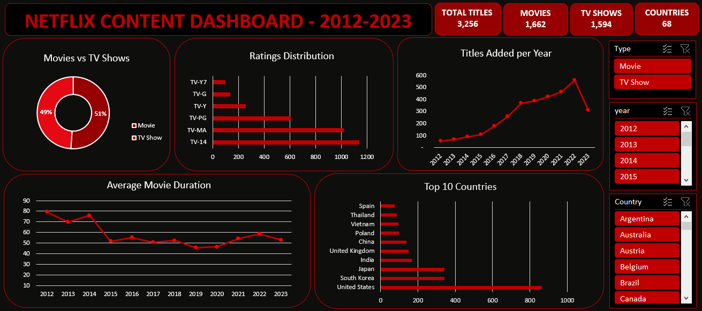

# Netflix-content-dashboard
An interactive Excel dashboard analyzing 3,256 Netflix titles (2012–2023).

## Overview

Built with Microsoft Excel to explore Netflix's global content library. The dashboard features 5 charts and 3 slicers for real time filtering.

## Dataset

- **Source:** Kaggle- Netflix Movies and TV Shows
- **Size:** 3,256 titles
- **Time range:** 2012–2023

## Tools Used

- Excel Tables
- Formulas (IFERROR, LEFT, FIND, LEN, SUBSTITUTE)
- PivotTables & PivotCharts
- Slicers with Report Connections
- Custom Slicer Styles

## Dashboard Components

| Visual | Insight |
|---|---|
| Movies vs TV Shows | 51% Movies, 49% TV Shows |
| Titles Added per Year | Grew 10x from 2012 to 2022 |
| Top 10 Countries | USA leads with 863 titles |
| Ratings Distribution | TV-14 + TV-MA = 66% of catalog |
| Avg Movie Duration | Dropped from 79 min to 46 min |

## Key Insights

1. Netflix's catalog grew from 53 titles (2012) to 558 (2022).
2. 66% of content is rated TV-14 or TV-MA.
3. USA produces 26% of all titles.
4. Average movie duration dropped 42% over the decade.
5. Catalog is nearly split evenly between Movies and TV Shows.

## How to Use

1. Download `NETFLIX dashboard.xlsx`
2. Open in Excel
3. Go to the **Dashboard** sheet
4. Use the slicers on the right (Type, Country, Year) to filter.

## Author

**Emelda Okafor** 

